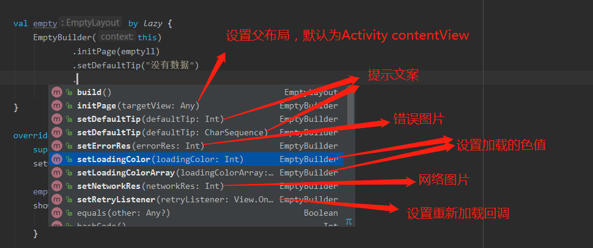

# EmptyComponent
xml布局文件可配置或者全部动态配置

#TabLayout 模仿微博切换动画
#CircleImageView 可自定义描边宽度、色值
#EmptyLayout 控制图定制化

#1、第一种使用方式【xml布局中使用】
     
     
     <LinearLayout
        android:id="@+id/emptyll"
        android:layout_width="match_parent"
        android:layout_height="match_parent"
        android:orientation="vertical">
        
        <com.youloft.widget.EmptyLayout
            android:layout_width="match_parent"
            android:layout_height="match_parent" />
            
    </LinearLayout>
    
    
    
 
 #2、动态创建

  